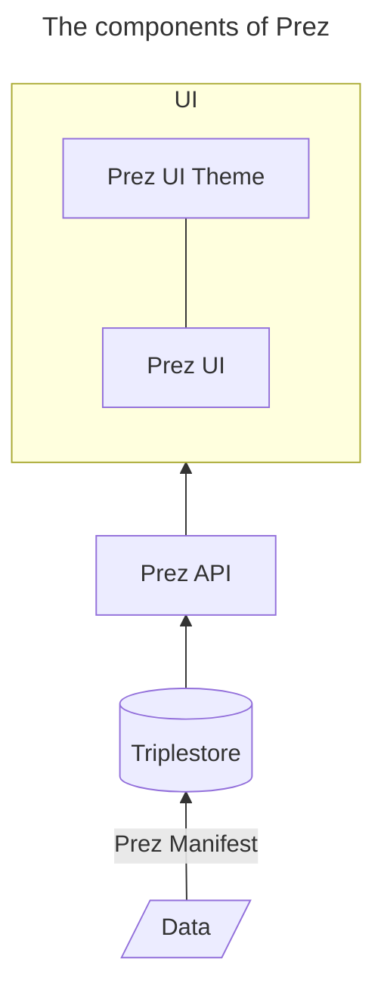

# About Prez

Go into some detail of the different components with a diagram - UI, API, triplestore, manifest, etc.

```mermaid
---
title: The components of Prez
---
flowchart BT
    data@{ shape: lean-r, label: Data } -- Prez Manifest --> triplestore
    triplestore[(Triplestore)] --> api
    api[Prez API] --> UI
    subgraph UI
        direction BT
        ui[Prez UI] --- theme[Prez UI Theme] 
    end
```
