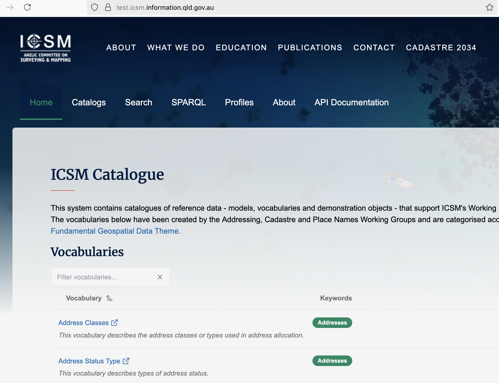
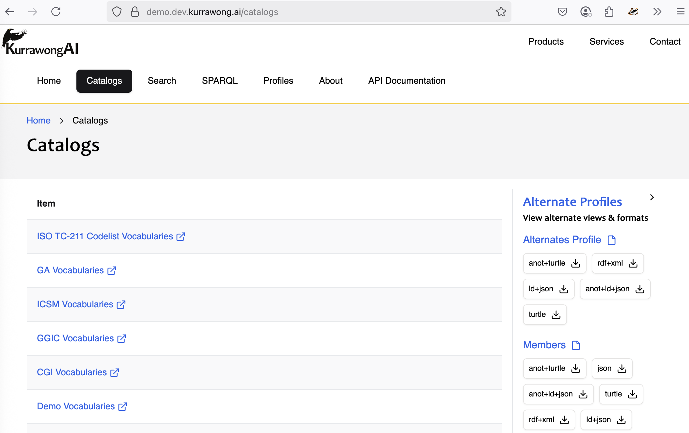
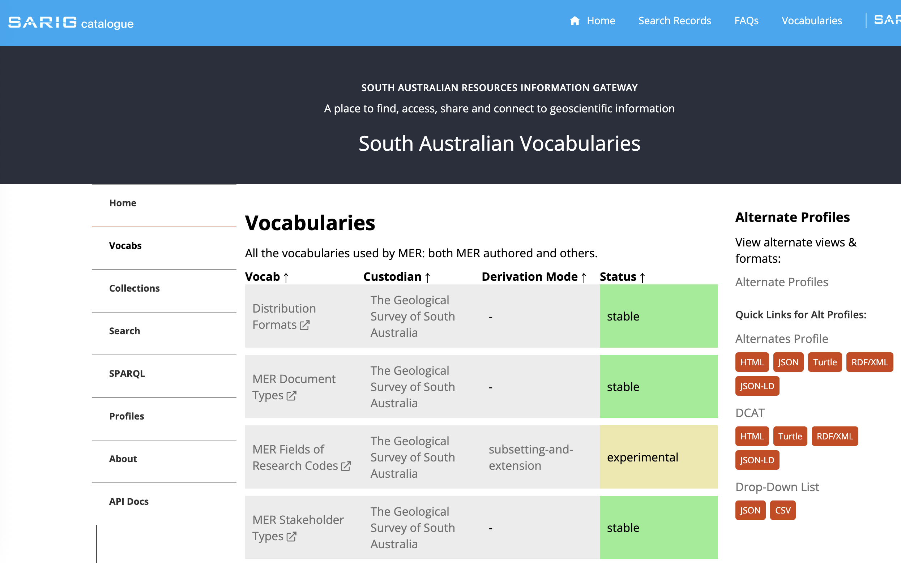
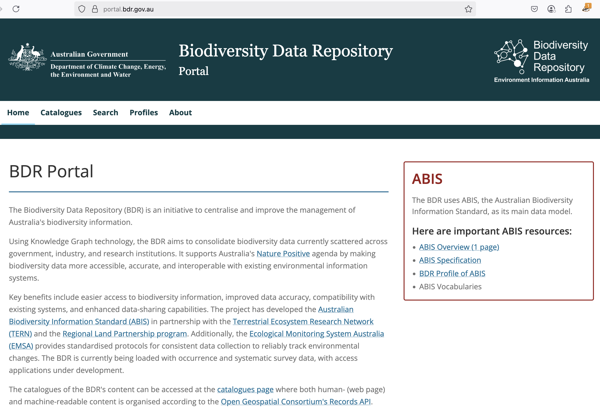

## What is Prez?

Prez is an open source web application API that delivers "profiles of Knowledge Graph data".

Prez is most commonly used to publish:

* lists of managed vocabularies
* catalogues of semantic resources
* spatial reference datasets

In addition to Prez the main API tool, there are a series of smaller tools - scripts - that can be used to prepare [Semantic Web](https://en.wikipedia.org/wiki/Semantic_web) for publication by Prez. These, and the Prez system use the Prez namespace, which is this web address:

* `https://prez.dev/`

## Show me

Here are some live instances of Prez online:

<a href="https://test.icsm.information.qld.gov.au/">
{width=45%, align=left}
</a>

<a href="https://demo.dev.kurrawong.ai/catalogs">
{width=45%}
</a>

&nbsp;

<a href="https://vocabularies.sarig.sa.gov.au/vocab">
{width=45%, align=left}
</a>

<a href="hhttps://portal.bdr.gov.au/catalogues">
{width=45%}
</a>

## How can I get Prez?

While being open source, Prez is mostly maintained by [KurrawongAI](https://kurrawong.ai) who provide professional services to assist with its use, see the [Prez Docs](https://docs.kurrawong.ai/prez/)

You can still run Prez, the API, and any other smaller Prez fools yourself by understanding how it works - see details via the link above.

If you need help, you can [contact KurrawongAI](https://kurrawong.ai/contact) who can assist you.

## Prez tools

Other than the main Prez (API) itself, the Prez tools are: 

* [Prez Ontology](ont.md)
* [Prez Manifest Model](manifest.md)
